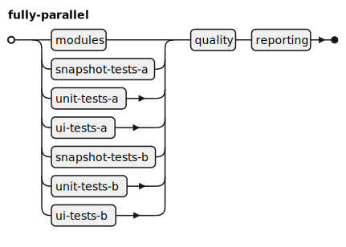
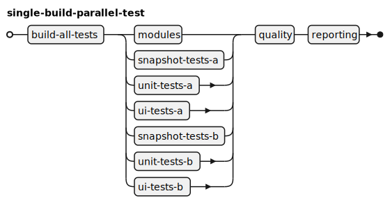
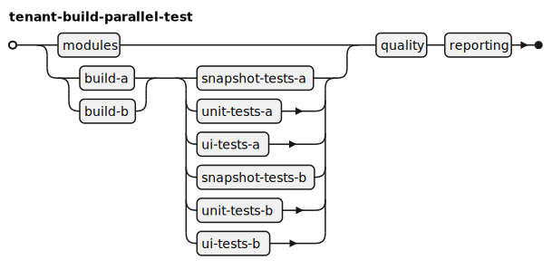
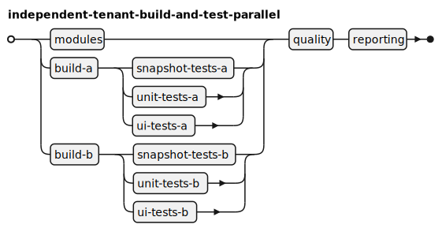

# Samples folder

In this folder, we provide some configuration files and structures that can be used to run a simulation and see how things behave, as well as some advice on how to read the results and what they can mean.

The examples here use a hypothetical setup for an iOS app.

We are running on-premise, and we have a number of fixed runners, let's say 14 macOS runners, and 14 Linux runners that can be used for miscellaneous tasks.

The app is a white-label source code that can be built into 2 different skinned apps. Let's call them tenants A and B.

The app codebase also contains multiple standalone modules, each with their own test suite. 

For each app, we want to run different kinds of tests: unit tests, snapshot tests, and UI tests.

We also have a code quality step (like Sonar or Codacy), and a final reporting step at the end. These can run on a Linux runner.

With all these baselines, we can sketch different ways to build and test the apps, with different trade-offs. For example, we can try to minimize the total running time, minimize the queue time, or optimize for re-run scenarios (e.g., flaky tests).

Also, consider that in GitHub Enterprise Server (on-premise GH), uploading big artifacts has a big time tax. A 500MB artifact could take about 5-7 minutes to upload.

## Fully parallel



We can organize the workflow to have each item built and tested in its own job. Assuming unlimited runners, this will be the most optimal way to run, giving the lowest theoretical minimum running time. However, runners are not unlimited.

### Highlights

* Minimum theoretical optimal.
* Each phase is a full build-and-test cycle.
* It avoids the big artifact time tax.
* Faster worst-case re-runs.

## Single build with parallel tests



We can organize the app project to build all the tests and both tenants in a single step (build-all-tests) and pass that artifact to the next stage, where tests are simply run against that artifact. The premise of this approach is that the build, done this way, can leverage some compiler internals and speed up the build time. However, this will produce a big artifact that has to be uploaded. On the other hand, the tests will run for a shorter time, making more runners available faster for other jobs.

### Highlights

* The build job builds all tests in one go, including all module tests.
* Tests are run in parallel.
* A big artifact.
* The first step creates a bottleneck.

## Build tenants separately, test in parallel together



Another possibility is to build the tenants separately (and the modules as well). Each job will compile in a shorter time (than [single build with parallel tests](#single-build-with-parallel-tests)) and produce smaller artifacts.

### Highlights

* Slightly faster theoretical optimal than single build.
* Faster build stages.
* Smaller artifacts -> faster upload.
* Segregated build stages allow re-building only the failing tenant.
 
## Independent tenant build and tests



An iteration on the structure above, where the testing stage will not wait for both tenants to be built before starting the testing. This will start testing a tenant as soon as it's ready.

### Highlights

* Slightly faster theoretical optimal than single build.
* Faster build stages.
* Smaller artifacts -> faster upload.
* Segregated build stages allow re-building only the failing tenant.
* Hypothesis: Less delay before tests per tenant can impact queuing time positively.

# Simulation time

We can simulate this directly using the CLI out of the box.

```shell
cd samples;
mkdir -p logs
mkdir -p data
for structure in $(find structures -name '*.yaml'); do; 
  time env JAVA_OPTS="-Djava.util.logging.config.file=logging.properties" \
  ../build/install/gha-simulator-cli/bin/gha-simulator-cli \
    --output data/$(basename $structure).output \
    --print-stats \
    configs.yml \
    $structure \
    incoming.txt
done
```
